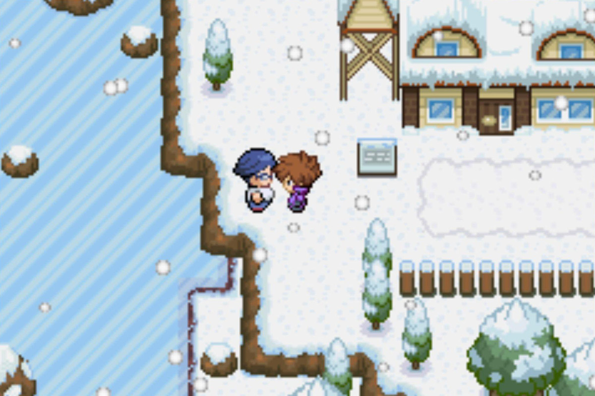
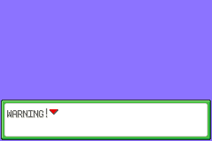
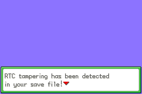
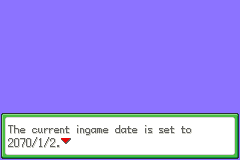
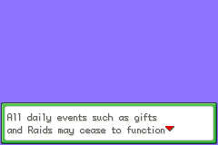
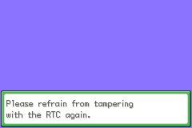

# Pokémon Unbound NPC Time Fixer Reset

A small browser-based and command-line tool that lets you reset/re-enable Pokémon Unbound's one-time **Time Fixer NPC in Frozen Heights** after it has already been used.

In plain terms, this is a way to reset/re-enable Pokémon Unbound's one-time **NPC RTC Time Fixer**. If you already used the NPC while your emulator or device RTC was still wrong, you can use this tool after correcting the RTC so the NPC can be used again and perform the real in-game repair.

## Screenshots

| Pokémon Unbound intro/title screen | Time Fixer NPC in Frozen Heights |
| --- | --- |
|  |  |

Screenshots are included for documentation/context. Pokémon Unbound and Pokémon-related assets belong to their respective owners.

Search terms: Pokémon Unbound RTC fix, RTC tampering detected, 2070 date bug, wrong date, Time Fixer NPC, Frozen Heights Time Fixer, GBAdhoc RTC, TempGBA RTC, PSP Pokémon Unbound, RTC warning after emulator migration, Time Fixer already used.

## How this solution came about

We encountered the problem while playing Pokémon Unbound on a PSP using **GBAdhoc**. The PSP's own date/time was correct and the time of day seen by the game could look correct, but Unbound's calendar ended up around **2070** and triggered its RTC-tampering protection.

Observed RTC warning sequence after moving the save to TempGBA:

| Warning | RTC tampering detected | 2070 date | Events disabled | Final warning |
| --- | --- | --- | --- | --- |
|  |  |  |  |  |

The 2070 value appears to be an RTC/calendar emulation or epoch problem in this scenario rather than the PSP clock itself being set to 2070. A 1970-like epoch value can surface as 2070 in Unbound while hours/minutes are still plausible. We have not established that every GBAdhoc build or every game has this behavior, so this repository documents it as an observed GBAdhoc/Unbound case rather than a universal GBAdhoc bug.

Unfortunately, the in-game **Time Fixer NPC** was used while that bad RTC state was still active. We later moved the same `.sav` to **TempGBA4PSP-Mod**. TempGBA correctly obtained the PSP date/time, and after saving there the save screen showed the correct current date, but Unbound continued to show the RTC tampering warning.

We tried **[PUSE](https://zannael.github.io/PUSE/)** RTC recovery / Quick Fix. The candidate tested with this particular save was rejected as corrupted and Unbound fell back to its previous save. That led us to investigate whether Unbound's own Time Fixer could simply be made available again.

Comparing the original GBAdhoc save, the migrated TempGBA save, different save generations, and RTC research published by [PUSE](https://zannael.github.io/PUSE/) led to a candidate one-time-use bit in logical section 4. Clearing that single bit made the Frozen Heights Time Fixer available again. With TempGBA now supplying the correct RTC, the NPC repaired the save normally. After saving and restarting, the RTC tampering warning was gone.

## What the fix does

The confirmed repair clears **bit `0x20`** at:

- logical save section: **4**
- relative offset: **`0xE89`** (decimal 3721)

In our tested save the target byte was `0x20`, so the edit was:

```text
0x20 -> 0x00
```

More generally, the tool performs:

```text
byte &= ~0x20
```

By default it patches **only the newest section-4 copy**, leaving the older generation untouched as a fallback. It intentionally does not recalculate section 4's checksum; that was the behavior that succeeded in the reproduced case.

**Important:** this one-byte edit does not itself repair the RTC metadata. It re-enables Unbound's own one-time Time Fixer so the game can perform the repair while a correct RTC source is active.

## Online/browser fixer

Open `index.html` locally or through GitHub Pages. Select your `.sav`, inspect the detected save generation and target byte, then click **Create patched save**. Processing happens entirely in your browser; the save is not uploaded to a server.

## Recovery procedure

1. Keep an untouched backup of the original `.sav`.
2. Make sure the emulator/device RTC is correct first.
3. Run the save through this tool and keep the generated patched copy.
4. Load the patched save in Pokémon Unbound. The RTC warning may still appear on this first boot.
5. Go to the **Time Fixer NPC in Frozen Heights, outside Professor Log's Lab**.
6. Let the NPC repair the RTC.
7. Save normally in-game and fully restart the game.
8. Confirm that the RTC tampering warning is gone, then back up the repaired save.

## Command-line version

```bash
python rtc_fixer.py "Pokemon Unbound.sav"
```

This creates `Pokemon Unbound.npc-timefixer-reset.sav`. `--all-copies` exists for deliberate testing, but newest-copy-only is the recommended default.

## Evidence and limitations

This method was reproduced successfully on the real save involved in the **GBAdhoc → TempGBA4PSP-Mod** migration described above. The same `0x20` state was present before and after migration. Clearing it in the newest generation re-enabled the NPC, and using the NPC under a correct TempGBA RTC removed the warning after restart.

That is strong experimental evidence for this recovery path, but it is not a claim that every Pokémon Unbound version, emulator, or RTC failure uses identical state. Please keep backups and report results if you test another configuration.

See `TECHNICAL.md` for the save layout and reasoning.

## Credits and acknowledgements

Thanks to **Zannael and [PUSE (Pokémon Unbound Save Editor)](https://zannael.github.io/PUSE/)** for publishing Pokémon Unbound RTC recovery research and the RTC manifest. That work was valuable in narrowing down the relevant save data and identifying section 4 offset `0xE89` as a candidate during this investigation.

Thanks also to the Pokémon Unbound, PSP homebrew, GBAdhoc, and TempGBA communities and developers.

Screenshot sources: the Time Fixer NPC screenshot is from the [Pokémon Unbound Wiki Frozen Heights page](https://unboundwiki.com/locations/frozen-heights/), the intro/title screenshot is from the [Pokémon Unbound Backloggd/IGDB listing](https://backloggd.com/games/pokemon-unbound/), and the RTC warning sequence is from the TempGBA screenshots captured during this investigation.

No Pokémon ROMs or user save data are distributed in this repository.

## License

MIT.
